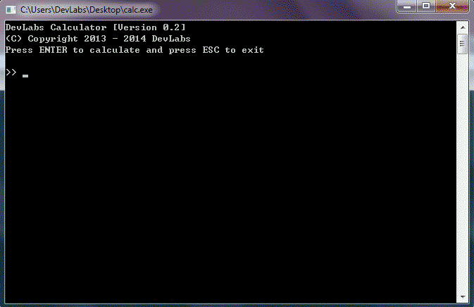
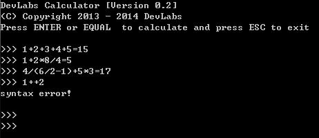

calc
====

编译原理实战之表达式计算器



---

### 前言
整理硬盘时翻出之前写的一个简单的表达式计算器, 想想当初为了理解这东西也费了不少功夫, 所以想写一篇笔记, 希望能给当初像我一样的菜鸟一点帮助. 原来只打算写表达式解析计算的方法, 写了一半后发现就光靠那点东西不一定使人看得懂代码, 所以干脆从头开始写起了.

考虑有表达式:

12 + 34 - 5

它将做为一个字符串输入计算机, 为了方便处理, 要对它先做词法分析. 
词法分析过程就是将输入字符串分解为token(记号)的过程. token是组成词法元素的最小单元, 对于上面的那个表达式, 它将会被词法分析器切割成如下token:

+ '12'
+ '+'
+ '34'
+ '-'
+ '5'

对于上面的表达式, 空格只是用于增强可读性, 并不具备词法或者语法意义, 所以被丢弃掉. 

### 错误处理.

有一句名言这样说, **永远不要相信用户的输入**. 对于一个表达式计算器, 我们可以限定用户只能输入数字和运算符, 但却不能阻止用户输入错误的表达式, 比如 12 + - 34 , 所以对于用户输入的表达式还要有一个语法处理的过程. 

语法规定了token的排列规则, 对于表达式计算器, 像 12+-34 这样的表达式是不合法的, 那要怎么样去检测一个表达式是否合法呢? 

假设此表达式计算器支持四则运算和括号, 那么它合法表达式的第一个token一定是一个数字或者左括号, 如果第一个token是数字的话, 那么第二个token一定是运算符; 而如果第一个token是左括号的话, 那么第二个token一定是数字. 

所以, **当读到一个token的时候, 下一个token的类型是可以预测的**. 表达式的语法并不复杂, 因此预测分支并不会太多. 当读入的下一个token与所有的预测分支都不相符时, 证明输入出现了语法错误.

词法分析器对外提供的接口:

```c
// 返回当前token的类型.
tokenizer_token();  

// 当前token是数字时, 此函数将ASCII形式的数字转为数字值.
tokenizer_num();

// 将当前token与期望(预测)的token做对比, 如果当前token不是所以期望的token, 则证明输入有语法错误. 
accept();

```

### 表达式求值

对表达式求值是此计算器的核心内容, 考虑如下表达式:

a + b * (c - d) / e

在此表达式中有5个因子, 涉及加减乘除四种运算和两种优先级, 另外还使用了括号提升了优先级.

计算机从左到右依次读入表达式, 但由于在表达式中存在不同的优先级, 所以顺序处理是不现实的, 因此需要寻找一种方法解决此矛盾.

如果表达式只有一种优先级, 那么问题就可以被很轻松的解决. 但很明显想要使得表达式只有一种优先级同样不现实, 但在数学中学过的一些化简公式的手段或许能给我们一些启发. 

设有如下表达式:

a * b + c / d

使得 M = a * b, N = c / d, 那这个具有两个优先级的表达式可以被化简为只有一个优先级的表达式 M + N, 而化简后的这个表达式是很容易被计算的, 唯一要做的就是在计算 M+N 时保证因子M 和因子N 都已经求值完毕. 

基于此种思想可以将复杂的表达式按优先级分层组合为简单的表达式, 由于组合后的简单表达式的因子也可能是一个表达式, 所以可对其使用递归处理, 从而得到表达式的结果.

```c

/**
 * \brief  取得当前因子的值, 若当前因子(类似上式中的M)是一个表达式, 进行递归求值
 */
int factor(void)
{
    int r;

    // 当前token的类型
    switch (tokenizer_token())
    {
    // 数字(终结符)
    case TOKENIZER_NUMBER:
        // 将其由ASCII转为数字值
        r = tokenizer_num();
        // 根据语法规则匹配当前token
        accept(TOKENIZER_NUMBER);
        break;
    // 左括号
    case TOKENIZER_LPAREN:
        accept(TOKENIZER_LPAREN);
        // 将括号里的值当作一个新的表达式, 递归计算(递归是从函数expr()开始的)
        r = expr();
        // 当括号里的表达式处理完毕后下一个token一定是右括号
        accept(TOKENIZER_RPAREN);
        break;
        // 除左括号和数字之外的其它token已经被上一级处理掉了
        // 若有其token, 一定是表达式语法错误
    default:
        error();
    }

    // 返回因子的值
    return r;
}


/**
 * \brief  求第二级优先级(乘除)表达式的值
 */
int term(void)
{
    int f1, f2;
    token_t op;

    // 获取左操作数(因子)
    f1 = factor();
    // 获取操作符
    op = tokenizer_token();

    // 操作符只能是乘或者除(同一优先级)
    while (op == TOKENIZER_ASTR || op == TOKENIZER_SLASH)
    {
        // 下一个token
        tokenizer_next();
        // 获取右操作数(因子)
        f2 = factor();
        switch (op)
        {
        case TOKENIZER_ASTR:
            f1 = f1 * f2;
            break;
        case TOKENIZER_SLASH:
            f1 = f1 / f2;
            break;
        }
        // 上面计算完毕的这个值将做为左操作数
        op = tokenizer_token();
    }

    return f1;
}

/**
 * \brief  求第一级优先级(加减)表达式的值
 */
int expr(void)
{
    int t1, t2 = 0;
    token_t op;

    // 第一个操作数
    t1 = term();
    // 获取运算符
    op = tokenizer_token();

    // 操作符只能是加或者减(同一优先级)
    while (op == TOKENIZER_PLUS || op == TOKENIZER_MINUS)
    {
        // 下一个token
        tokenizer_next();
        // 第二个操作数
        t2 = term();
        switch (op)
        {
        case TOKENIZER_PLUS:
            t1 = t1 + t2;
            break;
        case TOKENIZER_MINUS:
            t1 = t1 - t2;
            break;
        }
        op = tokenizer_token();
    }

    return t1;
}

```

表达式处理从expr()开始, 它只处理第一级优先级(加减)表达式的计算. 
首先它先要得到第一个因子的值, 而第一个因子可能是一个表达式, 所以它调用处理第二级优先级(乘除)表达式的函数term()试图得到此值. 

按理说在处理第二级优先级表达式的函数中一定可以直接得到此因子的值, 因为没有更高的优先级层次了, 但是因为括号中的表达式会被提升到最高优先级, 相当于又多了一个优先级, 所以检测括号的存在是必须的. 因此在函数term()中还要对此因子进行检查. 如果它是一个值的话直接返回即可, 但如果检测到左括号的话, 则括号中的部分将会被做为一个新表达式, 从而调用 expr() 进行递归处理, 只是这个递归跨越了几个函数, 圈绕的比较大. 

这个表达式计算器算是对编译原理的小实践, 简单的涉及了词法分析和语法分析的一小部分内容. 实际上这些东西很难做到不使用类似公式推导的手段而被简单精确的表达, 如果对兴趣的话可以参考<<编译原理>>进行深入系统的学习.  

2019-11-19 update:
由于某些原因又用到了这个东西, 所以对代码做了一点点更新, 主要是错误处理以及其它一些东西.

之前有朋友提交了一个更改, 我合并到了主分支, 主要更改是输入等号时也同样会计算结果, 且输入结果不再在下一行输入, 更改为在同一行的表达式后添加一个等号后换行输出, 但是有个小问题, 就是在不输入任何东西时直接按回车会出现一个等号, 此版本对此作了改进, 当未输入字符时不进行接下来的处理流程.



另外一个是更改错误处理, 之前是使用一个int型的全局静态变量 error_code , 使用宏定义来标识错误代码, 现在新定义了一个枚举类型 error_t类型, 新增加了一个错误表类型 error_table_t, 使用const数组存储错误码和对应的消息内容. 目前只有一种错误类型即语法错误, 所以看起来并无什么好处,但是当错误类型增加比较多后就比较方便了(不过此代码应该不会增加到那么复杂 :) ).


